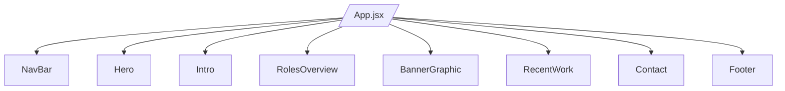

# Project Overview



## 1. High-Level Overview

- **Purpose:** A personal portfolio site for “Ram Prasad | Principal Software Engineer.”
- **Framework:** React with Vite (bundler + HMR).
- **Styling:** Plain CSS modules and global styles.
- **Linter:** ESLint with React plugins.
- **Output:** Static site suitable for any static-hosting platform.

## 2. Tech Stack & Configuration

- **Core:** React v19, React DOM, react-icons.
- **Build:** Vite (dev, build, preview).
- **Linting:** ESLint (@eslint/js, react-hooks, react-refresh).
- **Module Type:** ES modules.
- **Package Scripts:**
  - `npm run dev` (local server)
  - `npm run build` (production bundle)
  - `npm run preview` (serve built assets)
  - `npm run lint` (code quality)

## 3. Project Structure

```
Root
├── index.html
├── package.json
├── vite.config.js
├── eslint.config.js
├── public/
└── src/
    ├── main.jsx
    ├── App.jsx
    ├── styles/global.css
    └── components/
        ├── BannerGraphic.jsx & .css
        ├── Contact.jsx & .css
        ├── Footer.jsx & .css
        ├── Hero.jsx & .css
        ├── Intro.jsx & .css
        ├── NavBar.jsx
        ├── RecentWork.jsx & .css
        └── RolesOverview.jsx & .css
```

## 4. Component Breakdown

- **NavBar:** Site navigation links/logo.
- **Hero:** Headline & introduction graphic.
- **Intro:** Brief about you/mission statement.
- **RolesOverview:** Summary of skills/roles.
- **BannerGraphic:** Decorative banner or call-to-action.
- **RecentWork:** Portfolio items or case studies.
- **Contact:** Contact form or external links.
- **Footer:** Copyright, external links.

## 5. Setup, Build & Deployment

1. **Prerequisites:** Node.js (LTS) & npm.
2. `npm install`
3. `npm run dev` → http://localhost:5173
4. `npm run build` → outputs to `dist/`
5. `npm run preview` → verify production build
6. Deploy `dist/` to Netlify, Vercel, GitHub Pages, etc.